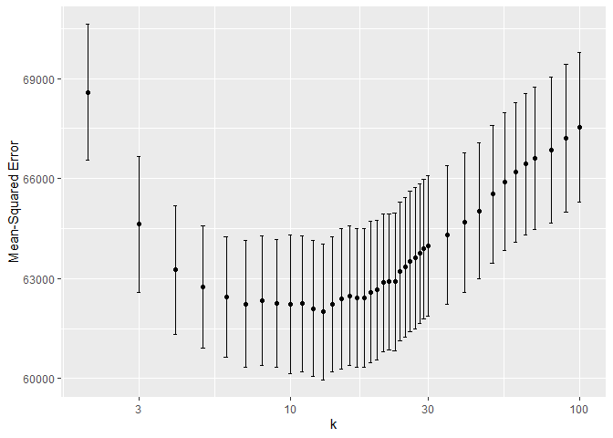

# Homework 2

Patrick Massey, Harrison Snell, Brandon Williams

## Problem 1

## Problem 2

We consider three models for predicting the sale price of a house for
tax authority purposes. In order to assess the predictive power of each,
we conduct a “horse race” to determine who has the best predictive
ability when compared to a withheld testing set of the data by
evaluating root mean squared error (RMSE); generally, the lower the RMSE
the better. The three models are:

-   Simple linear model (our medium benchmark model)
-   Linear model with additional features and an interaction term
-   K-Nearest Neighbor (KNN) regression

For all three models, we use a train/test split of the data: the
training data set is used to build the model and the testing set is used
to evaluate the model’s performance.1

Consider first the baseline model. This model uses 11 main effects from
the data set in a linear regression. It includes the variables lot size,
age, living area, bedrooms, fireplaces, bathrooms, rooms, heating
method, fuel method, and central air. This model performed consistently
the worst. In this iteration, for example, it achieved an average
out-of-sample mean-squared error of 66351.

This is to be expected. Economic intuition indicates that we are likely
omitting important considerations for house prices, notably land value,
waterfront access and whether or not it is a new construction. We add
these to our linear model to improve it, as well as an interaction term
for lot size and waterfront access.2 Indeed, we see
significant improvement in the RMSE. In this iteration, we see a
mean-squared error of 58552.

Finally, we attempt to create a KNN model. To begin, we include all
possible covariates and attempt to identify the value of K neighbors
that gives us the lowest mean-squared error. The following graph shows
the error on the vertical access and the value of K on the horizontal.

The minimum RMSE3 can be found at k=13 with a RMSE of 62000.
Consistently, across many iterations of train/test splits, the KNN model
had lower mean-squared errors than our baseline medium model but failed
to beat the better linear model. It appears that the data available to
us is better suited to the linear model we identified above. It is
possible the KNN model is over-fitting to the data and therefore
inducing higher RMSEs. We would therefore suggest pursuing a tax policy
that uses the improved linear model we proposed above.

### Footnotes

1 In order to account for random variation in the data
depending on how we split it, we use k-fold cross-validation which takes
k number (in this case, k=10) train/test splits and allows us to examine
the average error over each split.

2 The complete model is `price` regressed on `lotSize`,
`age`, `landValue`, `livingArea`, `bedrooms`, `fireplaces`, `bathrooms`,
`room`, `fuel`, and an interaction term of `waterfront` \* `lotSize`.

3 In order to truly compare lowest RMSE, we opt for choosing
the K that corresponds to the lowest RMSE, instead of choosing the
highest K within one standard error of the minimum (1SE method), which
could be argued for in this context.
